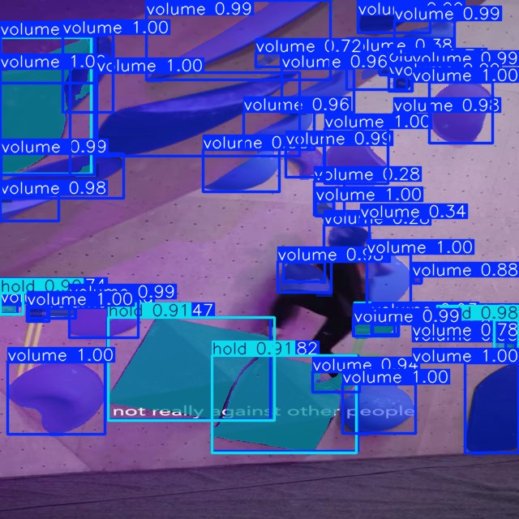

instance segmentation for climbing holds n dat using yolov11+modal

it works okay? disclaimer: no baiting this is an image from the validation set
but like still impressive to me. need more data to make the test set look as good as this.
also i flipped the classes when i processed the dataset lol volumes are holds and holds are volumes woops

